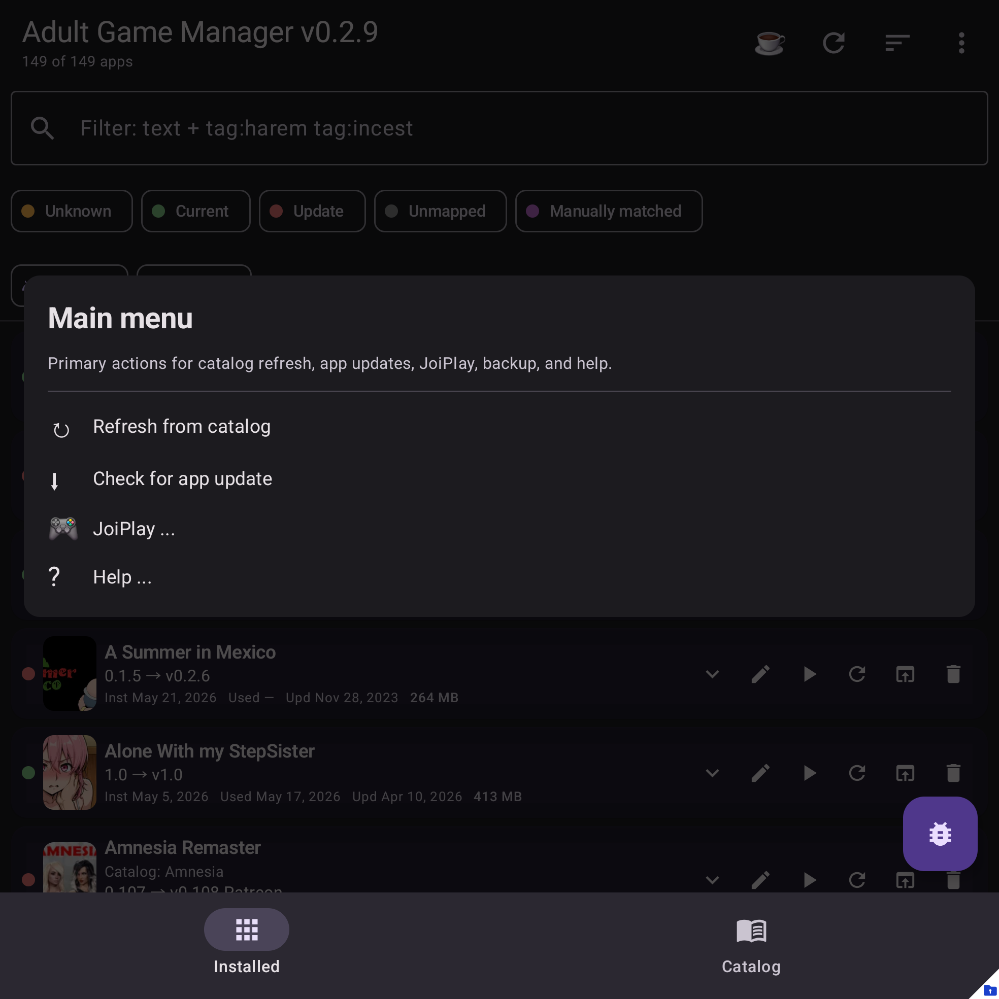
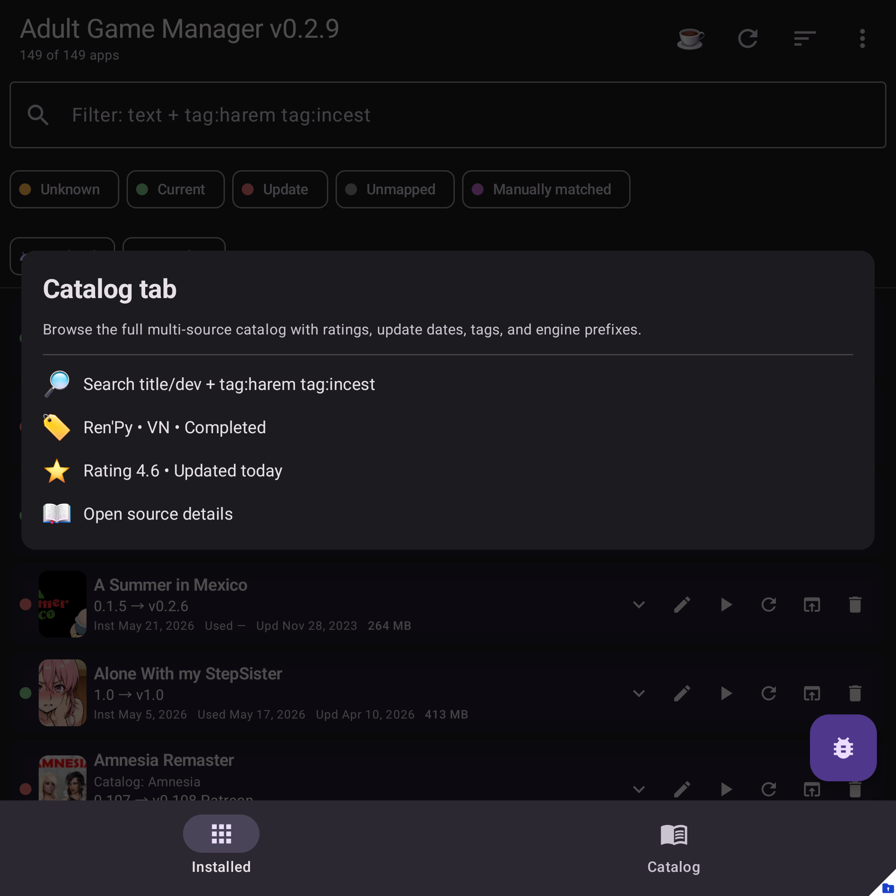

# Adult Game Manager

**Adult Game Manager** is a local-first Android companion for tracking adult game updates across installed APKs and JoiPlay games.

It keeps a searchable catalog, matches local apps and imported JoiPlay games to game pages, compares installed versions with the latest known versions, and opens the right page when an update is available.

## Download

- **Latest APK:** https://github.com/AdvancedAppCreator/adult-game-manager-releases/releases/download/app/AdultGameManager-latest-release.apk
- **Help/docs:** https://github.com/AdvancedAppCreator/adult-game-manager-releases#readme
- **Issues/support:** https://github.com/AdvancedAppCreator/adult-game-manager-releases/issues
- **Support thread:** https://f95zone.to/threads/299985/

## Help topics

The full help site source is in `docs/`. Until GitHub Pages is enabled for this repository, use these GitHub links:

| Topic | Link |
| --- | --- |
| Getting started | [docs/getting-started.md](docs/getting-started.md) |
| Permissions | [docs/permissions.md](docs/permissions.md) |
| Main screen tour | [docs/main-screen.md](docs/main-screen.md) |
| Matching games | [Auto-match](docs/mapping/auto-match.md), [manual search](docs/mapping/manual-search.md), [paste URL](docs/mapping/paste-url.md), [change match](docs/mapping/change-match.md) |
| Catalog | [Overview](docs/catalog.md), [sync](docs/catalog/sync.md), [browse/filter](docs/catalog/browse-filter.md), [review unmapped](docs/catalog/review-unmapped.md) |
| JoiPlay and installs | [Overview](docs/joiplay.md), [APK install](docs/installs/install-apk.md), [JoiPlay install](docs/joiplay/install-game.md), [settings](docs/joiplay/settings.md) |
| Backup and config | [Overview](docs/backup-config.md), [backup import/export](docs/backup/export-import.md), [app config](docs/backup/app-config.md) |
| Diagnostics | [docs/diagnostics/logs.md](docs/diagnostics/logs.md) |
| Self-update | [docs/self-update.md](docs/self-update.md) |
| FAQ | [docs/faq.md](docs/faq.md) |

## Why trust it?

Adult Game Manager is local-first. Your installed app list, mappings, personal notes, ratings, and JoiPlay data stay on your device unless you export a backup or explicitly upload diagnostics.

- No site login required.
- No hosted account, ads, or analytics SDKs.
- No automatic game downloader; the app opens the relevant page and you decide what to download.
- Public APKs, version metadata, catalog assets, changelogs, and help docs are hosted from this repository.

## Screenshots

| Main screen | Main menu | Catalog |
| --- | --- | --- |
|  |  |  |

## Features

- Track installed Android APKs and imported JoiPlay games in one list.
- Search/filter a catalog by title, tags, engine, status, rating, and installed state.
- Open matched game pages from the app.
- Install local APKs and JoiPlay archives from files you choose.
- Import JoiPlay `.joiback` backups.
- Export/import your app mapping state.
- Capture and upload diagnostics only when you explicitly choose to do so.

## Reporting problems

Open an issue with your app version, Android version/device model, what you tapped, what happened, and diagnostics/screenshots if available.

See the diagnostics help page: https://github.com/AdvancedAppCreator/adult-game-manager-releases/blob/main/docs/diagnostics/logs.md
