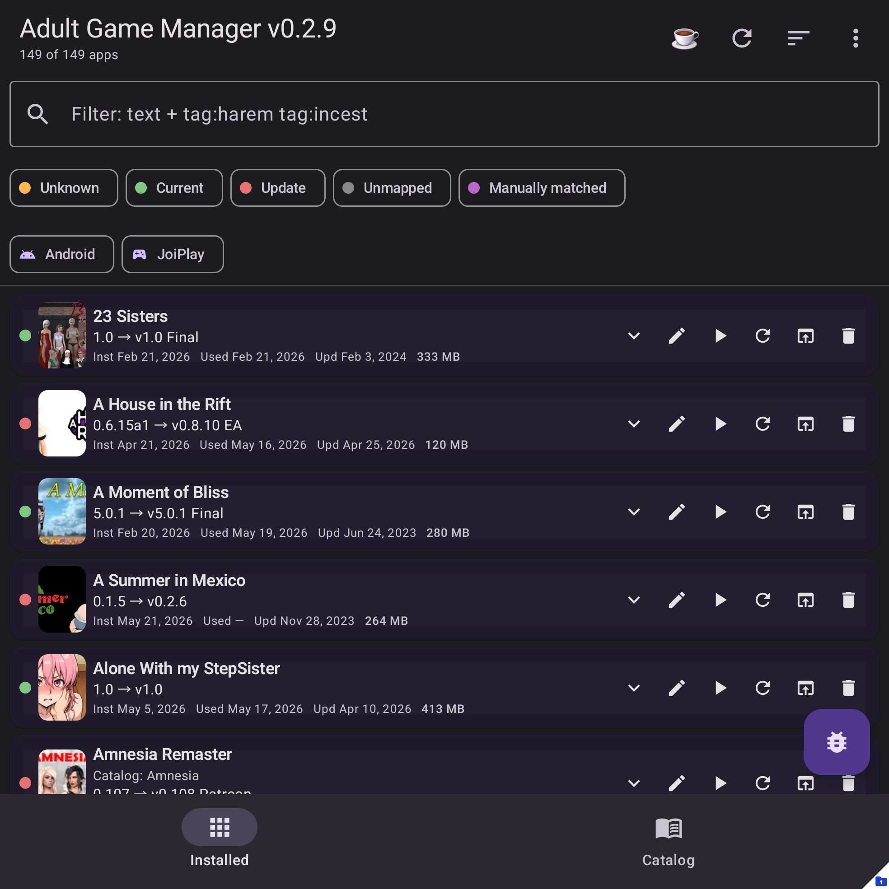
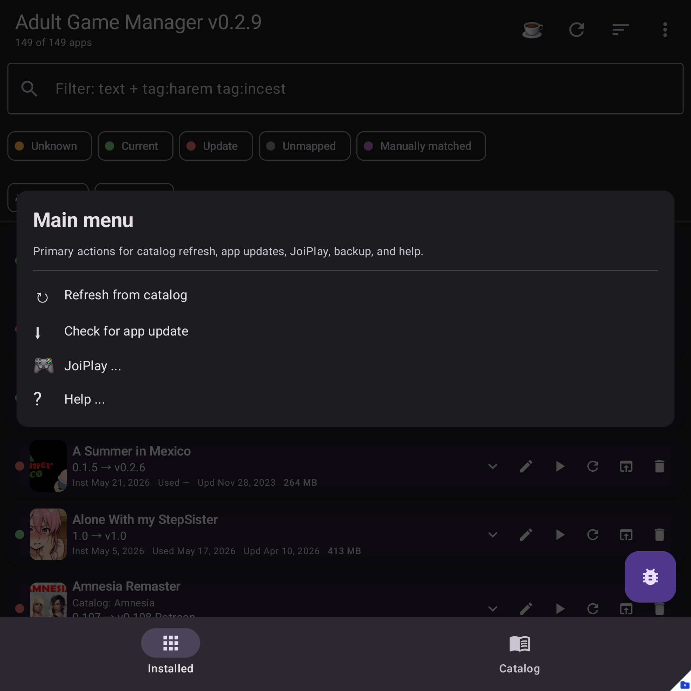
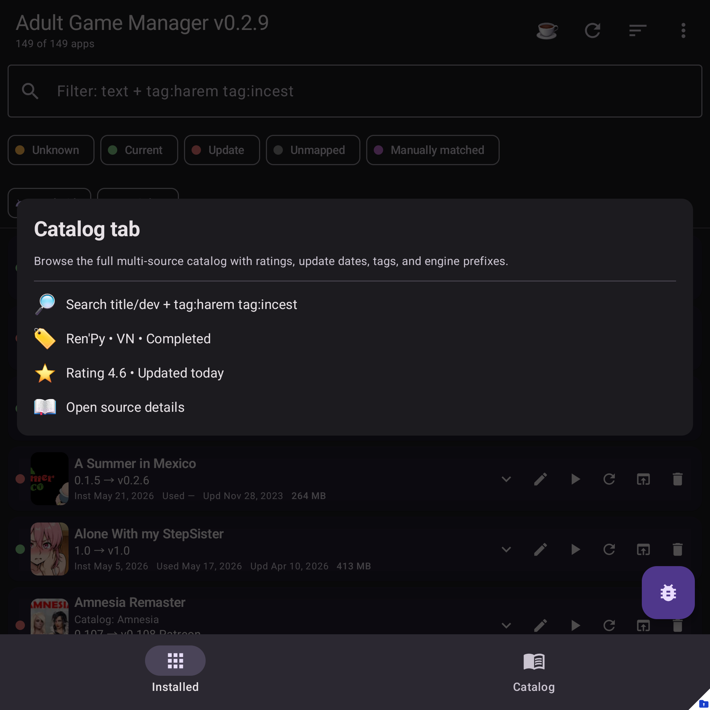

# Adult Game Manager

**Adult Game Manager (AGM)** is a local-first Android game library, update
tracker, launcher companion, installer, and save toolkit.

It keeps installed Android APKs and AGM-managed extracted games in one
searchable library, matches them to public catalog entries, compares versions,
and launches compatible games through JoiPlay, Winlator, or Kirikiroid2.

AGM does not require a site login, download games automatically, bypass file
hosts, or include analytics.

## Download

- **Latest signed release:** https://github.com/AdvancedAppCreator/adult-game-manager/releases/latest
- **Help/docs:** https://advancedappcreator.github.io/adult-game-manager-releases/
- **Issues/support:** https://github.com/AdvancedAppCreator/adult-game-manager-releases/issues
- **Support thread:** https://f95zone.to/threads/300548/
- **Source:** https://github.com/AdvancedAppCreator/adult-game-manager

## Help topics

The full help site is live at https://advancedappcreator.github.io/adult-game-manager-releases/. Source pages are in `docs/`:

| Topic | Link |
| --- | --- |
| Getting started | [docs/getting-started.md](docs/getting-started.md) |
| Permissions | [docs/permissions.md](docs/permissions.md) |
| Main screen tour | [docs/main-screen.md](docs/main-screen.md) |
| Matching games | [Auto-match](docs/mapping/auto-match.md), [manual search](docs/mapping/manual-search.md), [paste URL](docs/mapping/paste-url.md), [change match](docs/mapping/change-match.md) |
| Catalog | [Overview](docs/catalog.md), [sync](docs/catalog/sync.md), [browse/filter](docs/catalog/browse-filter.md), [review unmapped](docs/catalog/review-unmapped.md) |
| Install and update AGM | [Getting started](docs/getting-started.md), [Obtainium](docs/install-obtainium.md), [self-update](docs/self-update.md) |
| Launchers and installs | [Launcher setup](docs/launcher-setup.md), [JoiPlay](docs/joiplay.md), [APK install](docs/installs/install-apk.md) |
| Practical guides | [Ren'Py on Android](docs/guides/renpy-android.md), [Windows games with Winlator](docs/guides/winlator-android.md), [save safety](docs/guides/save-safety.md) |
| Why AGM? | [Feature comparison](docs/why-agm.md) |
| Backup and config | [Overview](docs/backup-config.md), [backup import/export](docs/backup/export-import.md), [app config](docs/backup/app-config.md) |
| Diagnostics | [docs/diagnostics/logs.md](docs/diagnostics/logs.md) |
| Self-update | [docs/self-update.md](docs/self-update.md) |
| FAQ | [docs/faq.md](docs/faq.md) |

## Why trust it?

Adult Game Manager is local-first. Your installed app list, mappings, personal notes, ratings, and JoiPlay data stay on your device unless you export a backup or explicitly upload diagnostics.

- No site login required.
- No hosted account, ads, or analytics SDKs.
- No automatic game downloader; the app opens the relevant page and you decide what to download.
- Signed APKs and source archives are published through the
  [source repository's releases](https://github.com/AdvancedAppCreator/adult-game-manager/releases).
- Catalog assets, changelogs, and help docs are published from this repository.

## Screenshots

| Main screen | Main menu | Catalog |
| --- | --- | --- |
|  |  |  |

## Features

- Track installed Android APKs and AGM-managed extracted games in one list.
- Launch supported games through JoiPlay, Winlator, and Kirikiroid2.
- Search/filter a catalog by title, tags, engine, status, rating, and installed state.
- Open matched game pages from the app.
- Install or upgrade several local APKs and game archives in one planned operation.
- Discover and edit supported Ren'Py and RPG Maker saves with backups.
- Analyze supported Unity texture metadata and configure compatible Winlator settings.
- Export/import your app mapping state.
- Capture and upload diagnostics only when you explicitly choose to do so.

## Reporting problems

Open an issue with your app version, Android version/device model, what you tapped, what happened, and diagnostics/screenshots if available.

See the diagnostics help page: https://github.com/AdvancedAppCreator/adult-game-manager-releases/blob/main/docs/diagnostics/logs.md
