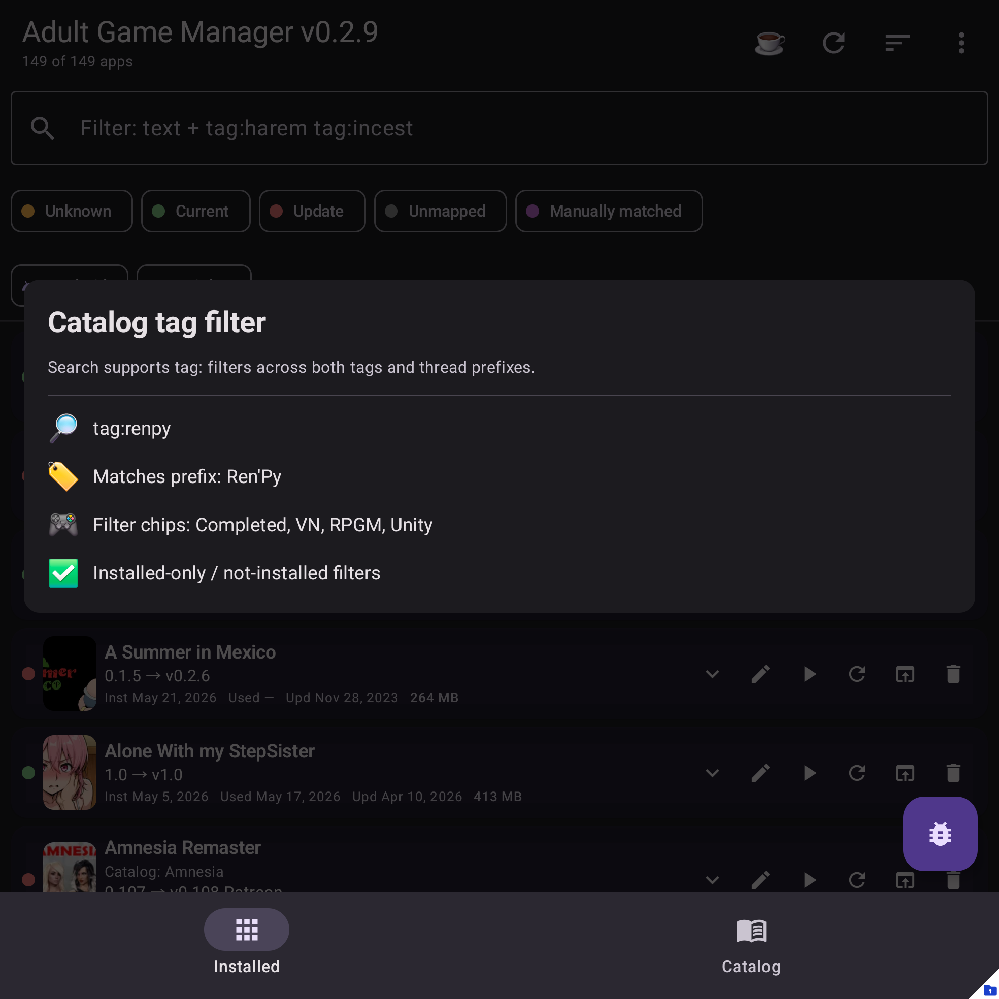

# Browse and filter

Catalog filters help you find games across all configured source catalogs.

## Where to find it

Open the **Catalog** tab.

## Common filters

| Filter | Use |
| --- | --- |
| Source | Limit results to one catalog source. |
| Platform | Show Android, Windows, Linux, Mac, or other platform metadata when available. |
| Installed state | Show installed, matched, or not-installed entries. |
| Tags | Search by one or more catalog tags. |
| Status / engine / rating | Narrow broad result sets. |
| Sort | Change result order. |

## Tips

Use source and platform chips first, then add tags or title search to narrow large catalogs.
