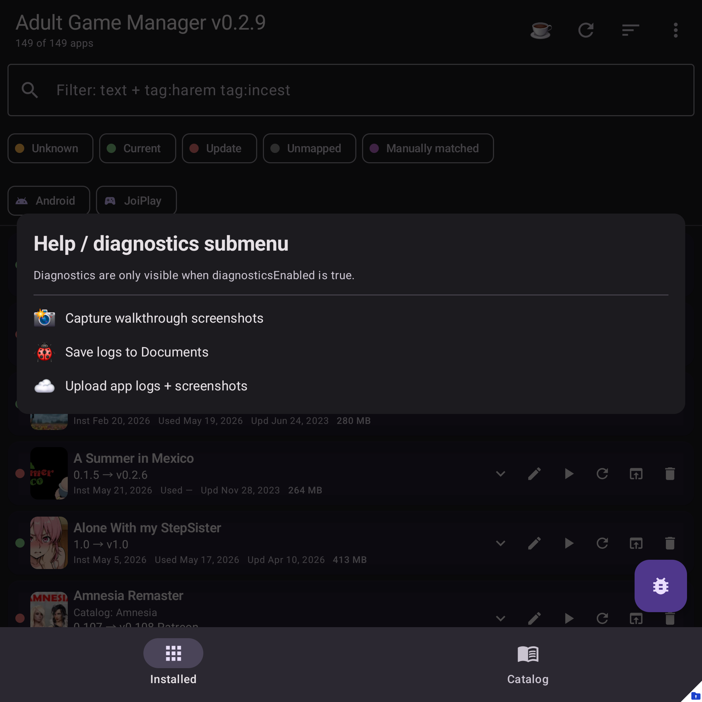

# Diagnostics

Diagnostics tools help troubleshoot app behavior without guessing.

## Where to find it

Menu -> **Help ...**

Always available:

- **Copy diagnostics summary** - opens a summary you can copy into an issue.
- **Save local diagnostics** - writes logs and queued crash reports to your Documents folder.

When diagnostics are enabled in `app_config.json`, more actions may appear:

- **Upload crash logs** - uploads queued crash reports to the configured upload target.
- **Upload app logs + screenshots** - uploads current app logs plus captured walkthrough screenshots.
- **Capture launch screenshots** - captures launch/onboarding screens for help docs.
- **Capture walkthrough screenshots** - captures the main help-site walkthrough screens.
- **Verbose logs** - toggles extra logging for the current run.

## Privacy

Diagnostics upload is explicit. The app does not upload logs or screenshots automatically, and the upload menu only appears when upload settings are configured.

