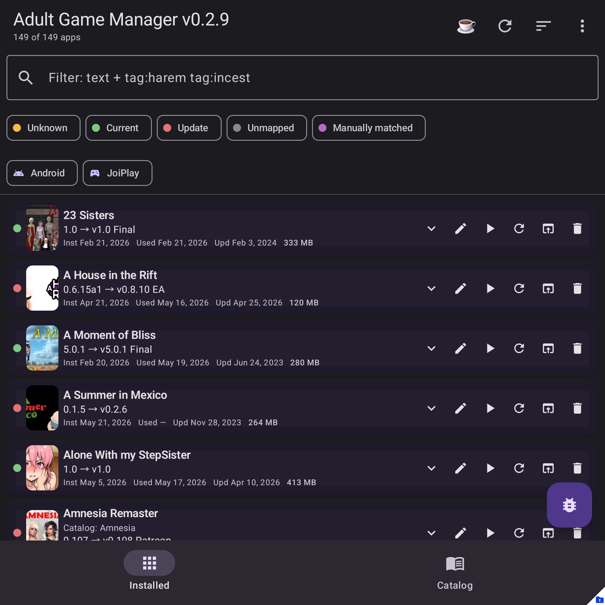

# Adult Game Manager

Adult Game Manager is a local-first Android companion for tracking adult game updates across installed APKs, JoiPlay games, and source catalogs.

[Download latest APK](https://github.com/AdvancedAppCreator/adult-game-manager-releases/releases/download/app/AdultGameManager-latest-release.apk){ .md-button .md-button--primary }
[Report an issue](https://github.com/AdvancedAppCreator/adult-game-manager-releases/issues){ .md-button }
[Verify releases](trust.md){ .md-button }

## What it does

| Area | Summary |
| --- | --- |
| Installed games | Lists installed APKs and imported JoiPlay games in one place. |
| Catalog | Searches a game catalog by title, tags, status, engine, rating, and installed state. |
| Matching | Links local games to catalog entries and shows version/update state. |
| Install helpers | Opens local APKs and JoiPlay archives you select; it does not download games for you. |
| Backup/config | Exports/imports app state and supports advanced `app_config.json` overrides. |
| Diagnostics | Saves local logs and, when configured, uploads logs/screenshots only after you tap upload. |

## Start here

- [Getting started](getting-started.md) covers installation and first-run setup.
- [Main screen tour](main-screen.md) explains the installed-games list.
- [Catalog](catalog.md) explains source catalogs, filters, and opening game pages.
- [Matching games](mapping/auto-match.md) explains how installed games connect to catalog entries.
- [JoiPlay](joiplay.md) covers local JoiPlay imports and install helpers.
- [Diagnostics](diagnostics/logs.md) explains logs, local saves, and optional upload.
- [Trust and verification](trust.md) lists source, checksums, and privacy notes.

## Privacy basics

- No site login is required.
- No hosted account, ads, or analytics SDKs.
- No automatic game downloader.
- Diagnostics upload is opt-in and only appears when configured.
