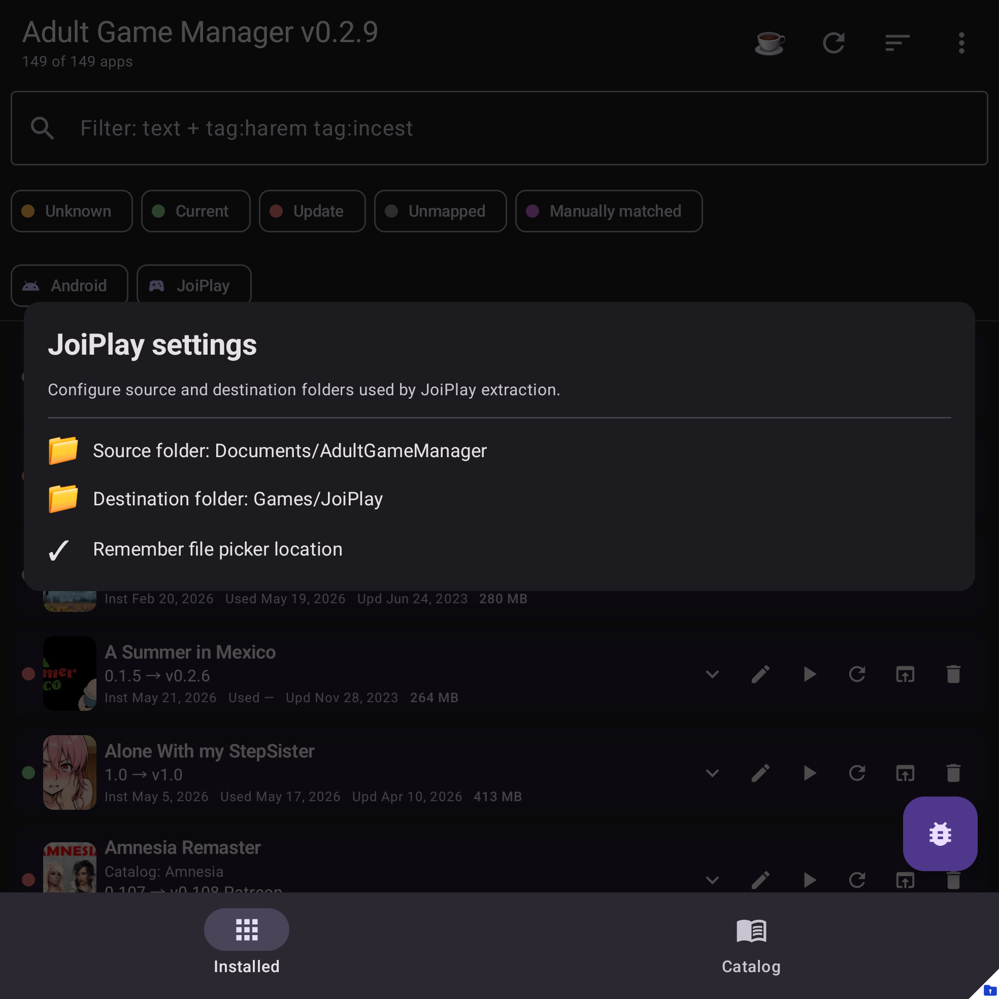

# JoiPlay settings

JoiPlay settings configure how Adult Game Manager finds and manages local JoiPlay games.

## Where to find it

Menu -> **JoiPlay ... -> JoiPlay settings**.

## Common settings

- JoiPlay game folder locations.
- Import behavior for `.joiback` backups.
- Install/update behavior for local archives.
- Safety options used before replacing folders.

## Tips

If imported games do not appear, confirm the folder location and import a fresh `.joiback` backup from JoiPlay.
